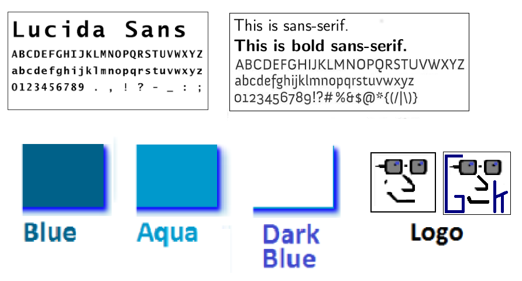

# george2kra.github.io

1. [Aim](#aim)
1. [The Building Process](#the-building-process)
1. [Thought Processes and Influences](#thought-processes-and-influences)
1. [Tools used](#tools-used)
1. [Challenges](#challenges)
1. [Fonts Colours and Logo](#fonts-colours-and-logo)
1. [Summary](#summary)
1. [Whats next](#whats-up-next)

# Aim
I am an Aspiring Web App Developer. I love to code, I dream about code, and after I wake up! I think about code while I am coding. I find it inspiring to watch my code come alive and do great things.

My purpose is to create a professional portfolio site that will highlight my intentional skills, my goals, and personality to attract continual employment or even promote my personal brand. My portfolio will be a simple design with visually appealing details that will show how simplicity can work to maximize a users experience.

The target audience is aimed at perspective employers looking for web app developers or other people seeking freelancers to complete a task.  

# Thought Processes and influences
As much as I love to code, I know enough that before I hit the keyboard I should map out a plan of my intending website. I started off with a blank canvas utilizing Figma tools to sketch out a base plan and referring to Pinterest for inspiring my wire frame. During the wire framing phase I pretty much decided to exploit the use of a bright white background that will allow the elements pop with contrast in order to stand out more.

Following with the theme of keeping it simple, I only allowed a few colors to dominate each section of any page. I decided to go with Blue and Aqua with shades of Grey as they all worked together with the White background. By minimizing the color palette it meant the audience was able to focus more on the content rather than being distracted by the fancy imagery.

In terms of the content, I made the subject matter succinct and concise as I am aware that any perspective employer will only want to spend 20 seconds reading a section. Therefore the challenge was to ensure my depiction represented me and my personality which was “I love to code!!”.  

# Tools Used

- Pen and paper
- Figma
- pinterest
- Trello
- DevIcons
- iPhone 6
- A photographer friend
- Some imagination

# Challenges
Being an aspiring coder, I had the challenge of trying to draw up a portfolio site describing my self with limited HTML and CSS knowledge, however restricting that was I did have the thirst to get something done and more importantly to have something suitable for the task.
The main degree of difficulty was to make it interesting for the reader, to try and incorporate a web page with slide containers, carousels, flex boxes and the like was a task to great to try and tackle within a week. Therefore keeping it simple, easy, homely, and interesting was going to be the theme for the reader.
My profile site will concentrate using key attributes such as hovering, some animation effects, shadowing, in order to maximize a readers pleasurable experience.

# Fonts Colours and Logo
I chose Blue, Dark blue, and Aqua as they compliment each other with a white background.

# Summary
Having a wire frame design first of the different screen sizes was a vital start of the process, it directed as to how best to code the HTML and CSS.

As I am at the early stages of learning CSS, I decided to stay with pure CSS to get a better understanding of how HTML & CSS interact with each other rather than using third party tool like bootstrap.

By using fewer features I was able to have my portfolio website responsive with minimal code, keeping it simple and elegant was the key by concentrating on the visual layout, good coloring choices and typography of a web page.

I quickly realized CSS is a very powerful and complicated tool, and now know why some people specialize in it, it  takes a lot to master it. At times I found CSS intriguing and a challenging adventure. I cant wait to know more about it.

Having the User experience (UX) in mind I focused on complimenting visual designs with dark backdrops and light shadowing with short brief and concise wording.

The most important feature of the portfolio site was to make the web pages responsive as the screen is resized, making the images tile next to the resized and fonts sizes as the screen enlarges to allow for easier reading maximizing the UX effect.

# Whats up next
I have learnt a lot with just using the basics, however I do know there is a lot more to know and do, I endeavor to  regularly update my portfolio site with new features as I continually learn the code.

I plan to incorporate the following features:
- Forms to make it easy for perspective employers to contact me.
- Carousel/Sliding containers to make items slide to show the new/next item.
- Flexbox or flexible boxes is a new feature in CSS3, I plan to keep images within a container to ensure they behave predictably when page layout changes to a different screen size.
- Footers to appear and stay in fixed point when scrolling to a different position of the site.
- Parallax by using a background content (i.e. an image) to moved at a different speed than the foreground content while scrolling.
 use the Bootstrap CSS framework to rapid prototype the second iteration of my webpage.
- Finally, start experimenting with Bootstrap, Java, and svg effects.
